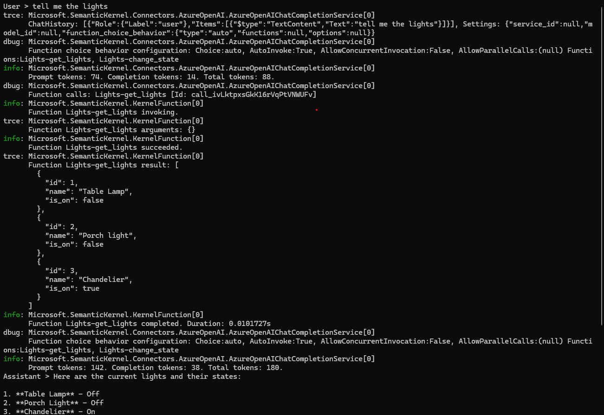
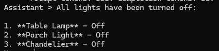
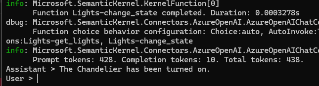

# LightsAppBot: .NET Azure OpenAI Function Calling

A C# console application demonstrating advanced **AI Function Calling (Tool Calling)** using **Azure OpenAI** and **Microsoft Semantic Kernel**. 

This project serves as a Proof of Concept (PoC) for building Agentic AI systems. Instead of just chatting, the AI acts as an orchestrator that can trigger real C# backend methods to manage a virtual smart home lighting system.

---

## 🚀 Tech Stack

* **Language:** C#
* **Framework:** .NET 8
* **AI Orchestrator:** Microsoft Semantic Kernel
* **LLM Provider:** Azure OpenAI Service (`gpt-4o-mini`)
* **Architecture Concept:** AI Plugins / Function Calling (`FunctionChoiceBehavior.Auto()`)

---

## 🧠 How It Works

1. **User Input:** The user types a natural language request (e.g., "Turn on the chandelier").
2. **Semantic Kernel:** Acts as the middleman, passing the prompt to the Azure OpenAI model.
3. **Function Calling:** The AI recognizes it doesn't have hands, but sees the `LightsPlugin` provided in the C# code. It asks the Semantic Kernel to execute the `change_state` method.
4. **C# Execution:** The .NET backend runs the code, changes the state of the light, and returns the result to the AI.
5. **Final Output:** The AI reads the execution result and replies naturally to the user.

---

## 📸 Example Prompts & Screenshots

Below are examples of natural language prompts handled by the bot, triggering the C# plugin methods:

### 1. Checking the status of the devices
**Prompt:** *"Show me the lights list"* 

### 2. Executing a bulk action
**Prompt:** *"Turn off all lights"* 

### 3. Targeting a specific device
**Prompt:** *"Turn on the chandelier"* 

---

## 🛠️ Getting Started

### Prerequisites
* **.NET 8.0 SDK** installed.
* An active **Azure OpenAI** resource with a deployed chat model (e.g., `gpt-4o-mini`).
* Your Azure OpenAI **Endpoint** and **API Key**.

### Setup Instructions
1. Clone this repository to your local machine.
2. Open the project in Visual Studio or VS Code.
3. Locate the configuration section in `Program.cs` and replace the placeholder values with your actual Azure OpenAI credentials:
   ```csharp
   var modelId = "gpt-4o-mini";
   var endpoint = "[https://YOUR-RESOURCE-NAME.openai.azure.com/]";
   var apiKey = "YOUR_API_KEY";
4. Build and run the console application.
5. Start typing commands to the AI!

## Project Structure

* **Program.cs:** The main entry point. Initializes the Semantic Kernel, configures the Azure OpenAI chat completion service, and runs the back-and-forth chat loop.
* **LightsPlugin.cs:** Contains the custom C# methods (`get_lights`, `change_state`) decorated with `[KernelFunction]` and `[Description]` attributes, allowing the AI model to understand and use them.
* **LightModel.cs:** The data structure representing a virtual light (`Id`, `Name`, `IsOn`).

---

## 📬 Contact

For any inquiries, feedback, or collaboration opportunities regarding this project, please reach out:

**Email:** mariusc0023@gmail.com
